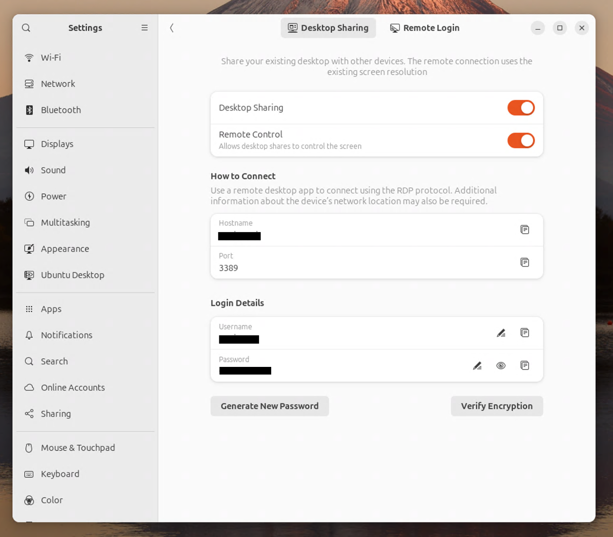

## 📌 RDP 비밀번호가 자꾸 초기화되는 문제 

{: width="70%"}{: .center}

Ubuntu 24.04의 Desktop Sharing 설정에서 로그인 비밀번호를 설정해둔 뒤, 재부팅하면 비밀번호가 초기화되는 문제가 발생했다.

이 문제를 해결하기 위해 커뮤니티를 뒤지다 다음과 같은 방법을 찾아냈다.

## 1. 새로운 Password Keyring 생성

{: width="70%"}{: .center}

Password and Keys 앱을 실행하고, 왼쪽 위 `+`를 눌러 "Password Keyring"를 생성한다.

keyring 이름은 맘대로 설정하고, **❗️비밀번호는 입력하지 않고 생성한다.❗**

생성 후 우클릭 > Set as default를 클릭하여 기본 keyring으로 설정한다.

설정하였으면 재부팅하자.

## 2. RDP 비밀번호 설정 

재부팅 후 다시 설정 > Desktop Sharing 메뉴로 들어가 비밀번호를 설정해준다.

이렇게 하면, 아까 생성한 새 keyring에 비밀번호가 저장되어 초기화되지 않는다.

다시 재부팅한 뒤, Desktop Sharing 메뉴로 들어가보면 비밀번호가 바뀌지 않았음을 볼 수 있다.

재부팅 뒤에도 기존 로그인 정보로 바로 RDP에 접속할 수 있게 된 것이다.

## 참고

- [22.04 - Remote Desktop Sharing authentication password changes every reboot](https://askubuntu.com/questions/1403943/22-04-remote-desktop-sharing-authentication-password-changes-every-reboot)